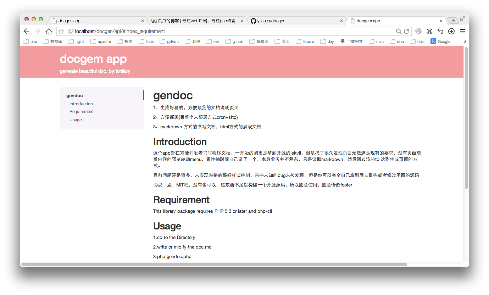

#gendoc {#index}

1、生成好看的，方便预览的文档说明页面

2、方便部署(目前个人部署方式cron+sftp)

3、markdown 方式的书写文档，html方式的展现文档

##Introduction {#index_introduction}

这个app旨在方便开发者书写程序文档，一开始的初衷是拿到开源的jekyll，但是找了很久发现页面无法满足现有的要求，没有页面随着内容的预览轮动menu，索性抽时间自己造了一个，本身业务并不复杂，只是读取markdown，然后通过渲染tpl达到生成页面的方式。

目前问题还是蛮多，未实现表格的很好样式控制，某些未知的bug未被发现，但是你可以完全自己拿到后去重构或者修改里面的源码

协议：恩，MIT吧，没有也可以，这东西不足以构建一个开源源码，所以随意使用，随意修改footer

##Requirement {#index_requirement}

This library package requires 	PHP 5.3 or later and php-cli

##Usage {#usage}

1.cd to the Directory

2.write or midify the doc.md

3.php gendoc.php

4.place all the api directory into apache or nginx's WebDev.

5.you can see the contents like above.

enjoy it!